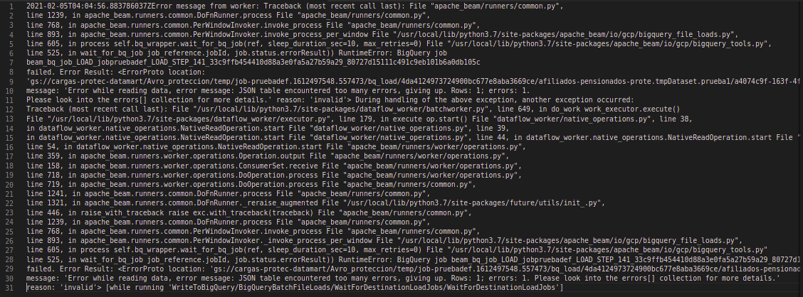

# What is bigquery ???

Imagine that you need to make a sql query that will scan petabytes of data, those amount of data can no be proccesed with relational database systems like mysql, oralce or postgresql.
 
Introducing bigquery. Bigquery it's a massive parallelized engine that allow you to query petabytes of information in seconds.

# what is apache beam ????

It's a software library (available in python and java) to parlalelize task in several servers, the difference with bigquery is that this one is for general use, in our case it is been used to dio ETL processes

# what were you trying to do ???

There were some data stored in excel files that I client needed to store in bigquery tables. We created a simple python file that open excel files using pandas a store the data in bigquery

# Can I see the code and the error ???

# What is the log saying ???

# Based on this log what should we to do to fix the error ???

That's the issue. the only line where we can barely start our analisys is the line 30, but although it is telling us that there is a problem reading the temp data because is invalidad we dont know why our data is invalid or what modification should we carry out to fix the issue.

# So what did you do in order to know the causes of the error  ???

The problem is inside of the library that we are using so we need to read the apache beam code  (especifically the part where the error is happening)

# How did you see the apache beam code  ???

Doing a google search, I found the github repository of apache beam

# How did you know what is the python file where the error is happening ???

This is a chain of calls, the method in line 2 calls the methos in line 3 and so on. The important file we need to analize is the line 525 in the file site-packages/apache_beam/io/gcp/bigquery_tools.py.

In the image below you can see the line 524 the error message that we are encountering **BigQuery job {} failed. Error Result**

# Ok, we have the line where error is happenig, whats next ???

At this point I already have an hypotesis, the problem is not in apache beam itself but in other code the apache beam library is calling.

You can go through the root of the problem finding where the wait_for_bq_job method is called (and what the job_reference is) and that would be a way to testing out the hypotesis or (probably easier) just look for the log of that job

Execute the command bq --format=prettyjson show -j beam_bq_job_LOAD_jobpruebadef_LOAD_STEP_141_33c9ffb454410d88a3e0fa5a27b59a29_80727d15111c491c9eb101b6a0db105c

And now we have a clue of what's wrong with our apache beam code

# What is the matter ????

As you can see this the, the source format for the bigQuery job is an json, but we were already creating  json list, what is wrong with our formatting ?

To answer that question we have to look in the gcp documentation how bigquery expect the json to be formatted

# And there you have it

# To fix it, just change the formatting of the json, this is the result

